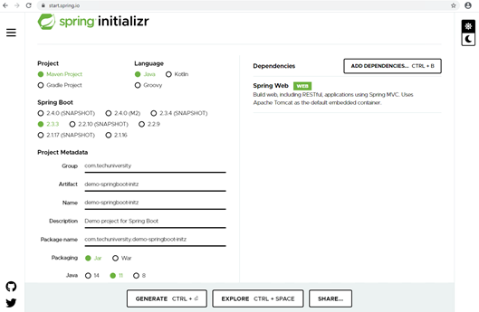

summary: Hola Mundo Spring Boot
id: APIEX02
categories: API
tags: back
status: Published 
authors: TechU
Feedback Link: http://bbva-techuniversity.appspot.com/

# APIEX02 - Hola Mundo Spring Boot
<!-- ------------------------ -->
## Overview 
Duration: 15

##### **APIEX02 **- Hola Mundo Spring Boot

Lo primero es crear el proyecto, pero en vez de hacer esto directamente desde el IDE para posteriormente descargar las dependencias o buscarlas a través de Maven o Gradle, vamos a apoyarnos de **[Spring Initializr](https://start.spring.io/)**, el cual realizará la configuración inicial básica para comenzar. El asistente nos pedirá algunos detalles mínimos sobre nuestro proyecto:

- sistema de construcción (**Gradle** o **Maven**)
- un lenguaje (**Java**, **Kotlin** o **Groovy**)
- y una versión de **Spring Boot** 

Vamos a construir una proyecto de aplicación web básica con Spring Boot con los siguientes datos:

- Project: Maven Project
- Language: Java
- Spring Boot: 2.3.3 (última estable)
- Packaging: Jar
- Java: 11

Este primer proyecto podemos crearlo sin añadir dependencias o como en el ejemplo la de Spring Web:



Ahora tenemos que descomprimir el .zip que contiene el proyecto web maven que Spring Initializr ha generado (Generate CTRL + Enter).

Volvemos a IntelliJ para importar (Import File) el proyecto.

Y finalmente ejecuta la aplicación: 

- desde el IDE: 

  ```
  run MainApp.main()
  ```

  

- con comandos maven:

  ```
   ./mvnw spring-boot:run
  ```

  

Referencias: https://spring.io/guides/gs/spring-boot/  

https://spring.io/guides/gs/spring-boot/#scratch