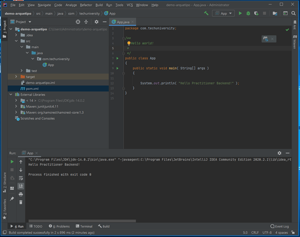

summary: Crear nuestro primer proyecto Maven con IntelliJ IDEA
id: GPEX02
categories: Proyectos
tags: back
status: Published 
authors: TechU
Feedback Link: http://bbva-techuniversity.appspot.com/

# GPEX02 - Crear nuestro primer proyecto Maven con IntelliJ IDEA
<!-- ------------------------ -->
## Overview 
Duration: 30

##### **GPEX02** - Crear nuestro primer proyecto Maven con IntelliJ IDEA

1. En la ventana principal del IDE ir al Menu **File -> New -> Project…**

2. Se abrirá el Asistente **New Project**.

3. Antes de que nos olvidemos, elije en el desplegable el Project SDK (JDK)

4. Selecciona **Maven** en el panel izquierdo y luego marca la opción **Create from archetype**

5. Vamos a coger un arquetipo de ejemplo: maven-arquetype-quickstart

6. Ahora tenemos que insertar los datos del proyecto (Artifact Coordinates)

   - *GroupId* : com.techuniversity
   - *ArtifactId* : demo-proyecto-maven
   - *Version*: 1.0.0

7. Abrir el archivo de configuración del proyecto pom.xml y observar su contenido.

   

   

   Probar comandos básicos de maven para crear un proyecto en la consola PowerShell u otra.

8. Arquetipos propuestos para probar: maven-webapp, maven-jpa, sin arquetipo

   Referencias: https://maven.apache.org/guides/introduction/introduction-to-archetypes.html

   https://javaspringvaadin.wordpress.com/2018/05/22/mavenintellijidea/

